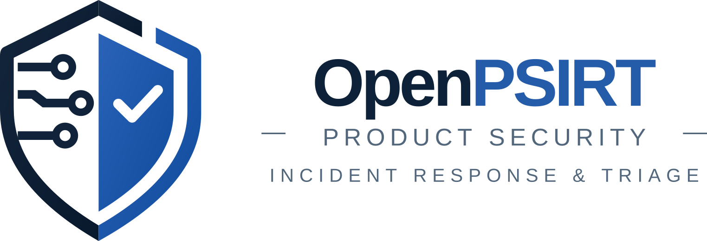

<picture>
 <source media="(prefers-color-scheme: dark)" srcset="assets/openpsirt-logo-wide-dark.svg">
 
</picture>

# OpenPSIRT

Track vulnerabilities in the products you ship.

OpenPSIRT takes in the inventory a build produced, scans it for known
vulnerabilities, works out what changed release to release, and gives people
somewhere to triage what it finds and follow it through to a fix and an
advisory.

!!! note "Alpha"
    Below 1.0 the API and the schema carry no compatibility promise. A
    database built by v0.1.0 or v0.2.0 is upgraded in place; a database built
    by any other earlier build is recreated. [Current state](built.md) says
    what is built and what is not.

## Scope

- Takes in inventories pushed by build pipelines, in CycloneDX or SPDX form,
  with the suppressions the build carries patches for
- Runs the scan in the deployment, so every product is measured against one
  scanner and one set of vulnerability data
- Keeps the dependency graph, so a vulnerable component shows why it is present
  and which part of the product pulled it in
- Records why every finding closed, such as an upgrade, a removal, a carried
  patch, or a scanner that went quiet
- Carries triage decisions forward, so a nightly scan leaves the work standing
- Rescans shipped releases, so a vulnerability published after a release is
  still found in it
- Takes vulnerability reports from outside, judges them, and records flaws in
  our own product
- Generates CSAF advisories and per-build VEX documents, and writes the
  advisories out as a CSAF provider directory
- Reports what was fixed between releases, what was dismissed and why, what is
  running out of time, and whether the team is keeping pace

## Out of scope

| | |
|---|---|
| Generating SBOMs | The build does that |
| Discovering what is in a product | The component list always comes from the build |
| Building or deploying fixes | A fix is declared here and confirmed by the next scan |
| Sending an advisory anywhere | A published advisory belongs to whoever publishes it. OpenPSIRT writes the files |

## Builds over time

A build's inventory moves every night. Each move is recorded as what it did to
the findings and to the judgments standing on them.

| When a build changes | What is recorded |
|---|---|
| An upload arrives | A receipt naming the component names it added, removed and moved. An upload that moves more of the build than the deployment allows raises an alert |
| A component's version moves | The finding at the old version closes as upgraded, or as superseded where the issue came with it. The new finding records the version it arrived from |
| The version moves and the fix does not arrive | The finding is marked as an incomplete upgrade |
| The shipped version changes and the upstream one does not | The finding closes as revised, which is what a carried patch looks like from outside |
| A component leaves the build | Its findings close as removed |
| The scanner stops reporting something present and unchanged | The finding closes as unexplained, and that is flagged at any volume |
| The vulnerability data moves | The scheduled rescan finds it, in shipped releases as well as current ones |
| A judged component, or what pulls it in, moves version | A judgment about risk lapses and returns to triage. A claim that the scanner matched the wrong thing stands |
| Another release or variant ships the same code | The judgment already made there applies |
| A fix is declared for a set of releases | The next scan of each release says whether it arrived |

| Cost | |
|---|---|
| A finding is a component at one place | One switch image is 335,021 findings, 305,487 of them one kernel across 62 modules. Tracking at that grain is heavier per build than tracking per package, and it is what lets a judgment hold in one place and not another |
| A finding is stored once | With when it opened and when it closed, never once per scan |
| Nightly branch scans are transient | Tagged releases are retained |

## Features

[REQUIREMENTS.md](https://github.com/nexthop-ai/openpsirt/blob/main/REQUIREMENTS.md) carries the reasoning behind every line
here, and [Current state](built.md) lists what is not built.

### Ingest

- Inventories arrive from the build as CycloneDX, SPDX 2.2 and 2.3, or SPDX
  3.x. The document states its format, and the reader follows the document
- An upload is accepted, queued and answered later. A scan applies whole or
  changes nothing, and only a scan newer than the state it replaces is taken
- A product, its releases and its variants are declared before a scan may name
  one, so a misspelled release is refused
- A product, a release or a variant is renamed or retired. Retiring takes it
  out of every list and refuses new scans against it, and keeps everything
  filed. Declaring it again brings it back. A name is fixed once a published
  document names it
- Identity is derived from content. Nothing a scan file supplies is trusted to
  be stable between builds or consistent between producers
- Every upload has a receipt listing which component names it added, removed
  and moved to another version
- A third party's VEX document, or a supplier's CSAF security advisory, is
  uploaded by an administrator as evidence

### Scanning

- The deployment scans everything it tracks, on a schedule, with one scanner
  and one set of vulnerability data
- A build's own suppressions are applied and never re-decided
- The scanner, its vulnerability database and the exploitation feeds all run
  with no network. By default the scanner keeps its own database current; an
  air-gapped install loads a bundle in its place
- Every finding records what produced it: which scanner, which version, which
  database, and how the match was made
- An issue keeps a CVSS 3 and a CVSS 4.0 rating side by side where both are
  published. The newest generation is the one shown, and every number carries
  its scheme
- Candidate upgrades are ranked for ecosystems with a written ordering: Debian,
  RPM, Alpine, PyPI, Maven, NuGet, and Semantic Versioning for Go, npm and
  Cargo. Everything else stays unranked
- OpenPSIRT publishes an inventory of its binary and its image, and scans
  itself with them

| Optional | What it adds |
|---|---|
| Upstream currency | The newest release upstream for a component, asked of the Go, npm, PyPI, Cargo, Maven and NuGet indexes. Names the deployment calls its own are never sent |
| Patch branches | Which branches hold each patch commit a report links to, from a kept copy of the repository. Fetched through a proxy that refuses private address space and any excluded host |
| Supplier advisories | A supplier's CSAF provider directory, read on the scan schedule. Each document is checked against the digest published beside it, and only claims about components a build ships are kept |

All three are off by default. [Configuration](configuration.md#features)
says what turns each on.

### The tracked unit

- The tracked unit is a product, a branch or tag, and a variant. A release
  carries a reversible end-of-life date, past which nothing is deleted or
  hidden
- The dependency graph is kept as nodes and edges and walked when asked. One
  shared library was 49,170 flattened paths against 48 direct consumers
- A finding is one component at one place in one build. Twelve places is twelve
  findings, and grouping is presentation only
- An issue is one issue across every name it goes by, and everything each
  report said about it is kept

### State and history

- Change over time is a primary query
- Findings open and close themselves as scans change, every closure records
  why, and a disappearance nobody can explain is flagged at any volume
- Triage history is append-only. Each record is written in the same
  transaction as the act it describes. The database is trusted, and nothing
  defends against somebody editing rows directly
- Administrative changes record who changed what from what: settings, grants,
  the catalog, and records of exploitation
- What a scan observed is kept apart from what a person declared

### Triage

- Every finding takes one outcome: affected, not applicable, deferred, will not
  fix, already fixed here, a wrong match, or one of the two that promise work
- A dismissal needs a written reason and a second person's approval. The
  proposer never approves their own, with no override. Short deferrals are
  exempt up to a cumulative threshold the deployment sets
- A judgment about risk survives rescans and lapses when the upstream version
  of the component, or of anything that pulls it in, moves. It carries to other
  releases, tags and variants whose chains and versions match
- A wrong match is a claim about identity. It stands at every version until
  somebody withdraws it, and always needs a second person
- One judgment covers every place a finding sits
- A bulk judgment is one act across many issues at a component, recording how
  the set was chosen. One that sets findings aside is bounded by a cap the
  deployment sets; a bulk promise to upgrade takes no cap
- An approver approves, sends back or undoes a batch as one act. An approval
  points at one revision of the reason, and editing the text withdraws it
- A rating that disagrees with the published one, or a note for whoever
  decides, belongs to one product and applies to every build of it
- A third party's word is evidence. The build's suppressions, a supplier's VEX
  and a supplier's advisory are shown beside the finding, and offer a prefill
  only at the versions they name
- A deployment sets what it considers worth triaging, and a product may set
  something narrower. Below the line a finding is still recorded, counted and
  reportable, and any list that hides something says how much

### Vulnerability reports

- A report of a flaw is recorded before anybody judges it, under a reference
  minted per product. Files arrive with it
- One form takes every report. It asks whether the flaw came from outside or
  was found here, and whether to file it for judging or record it as a flaw
  now
- Each product has an inbox of reports waiting for a judgment
- A report is judged one of five ways. Every way but acceptance is a ruling,
  which covers one report or many in one act:

| Judgment | Takes effect |
|---|---|
| Accepted, as an existing issue or a new flaw | At once, one report at a time |
| Duplicate of an issue open here | At once |
| Not reproducible | At once |
| Out of scope | When a second person approves |
| Rejected | When a second person approves |

- A flaw in our own product is recorded under an identifier this deployment
  mints, against every build that ships it
- Reading reports takes a private read role. Recording, answering and judging
  them takes private triage

### Ranking and remediation

- One urgency orders the queue, worked out from a record that this product was
  attacked through the issue, severity, known exploitation, exploitation
  likelihood, and whether the component reaches customers
- A deadline is set by policy from severity and known exploitation. It counts
  from the latest of when the finding was first seen, when exploitation was
  learned, and when a fix became available
- A flaw in our own product runs on deadline windows of its own, counted from
  when it was first given a severity
- A finding with no deadline says why: nobody has rated it, it is below the
  line, upstream has no fix to take, or its release is a tag or out of
  support
- Being overdue is reported, never acted on automatically
- Work is assigned to a person or a team. A team queue is picked from, work
  nobody holds is routed to a team by standing rule, and a person's assignment
  always wins
- A fix is declared as the set of releases it targets, and each later scan says
  whether it arrived

### Disclosure and advisories

- A flaw recorded here starts undisclosed. One reported from outside carries a
  disclosure date, 90 days from when the report arrived by default. One found
  here carries none. Reaching the date escalates and publishes nothing
- A disclosure date moves either way, as two separate acts. Each takes a
  reason, and past a threshold a second person, and is raised before the date
- A record is written to be disclosed whole: comments, decisions, actors.
  People writing in it know that from the first word
- An issue is disclosed in a product with a reason, and its whole record turns
  public. On or after the date it takes effect at once; before it, a shortening's
  threshold applies; with no date, a second person always agrees. It cannot be
  undone
- An advisory is a record of its own, under an identifier this deployment
  mints. It covers one flaw or several, across products, and is generated as a
  CSAF 2.0 document

| Advisory state | Means |
|---|---|
| Final | A second person agrees to what it says now, whether or not it has gone out |
| Interim | It has gone out, and no agreement stands on what it says now |
| Draft | Neither |

- A second person agrees to one edition of an advisory. Editing it takes every
  agreement back. It stays TLP:RED while anything it covers is undisclosed
- What went out is kept byte for byte, and the advisory says whether it has
  changed since
- Every advisory revision that went out marked for anybody to read is written
  into a CSAF provider directory: provider metadata, an index, a change list, a
  feed, and a checksum beside each document. Another web server serves it
- Each build has an OpenVEX document, generated from approved dismissals, with
  a stable name and a revision chain. Each version that went out is kept

### Attacks and obligations

- A person records that a product was exploited through an issue: when it
  became known, and what happened. Clearing the record takes a reason, and the
  cleared record stays readable
- That record outranks every feed in the queue, refuses a claim that the issue
  does not apply, and sends a standing claim of that kind back for review
- An administrator declares the windows an attack may oblige a notice within,
  in hours from when it became known. A window covers every product or the
  ones it names
- Notices given to somebody outside are recorded, append-only, against the
  window they answer
- A standing-attacks screen lists every record. An alert is raised as each
  window opens, at the warning a window declares, and as it passes
- A bulk judgment that would dismiss or defer an attacked issue is refused.
  Nothing here decides whether an obligation applies or was met

### Access and permissions

- Sign-in is federated: OpenID Connect, GitHub or a trusted header. No account
  is created for anybody nothing authorized in advance. Where roles come from
  identity-provider groups, that mapping is the advance grant
- Roles are granted per product, or once across every product including ones
  declared later. Administration and reading the deployment's own records are
  permissions of their own. A product somebody holds no role on is invisible to
  them: not listed, not counted
- Public and private findings are separate grants: read public, read private,
  triage public, triage private. Somebody who works both holds both
- Visibility is enforced in the data-access layer, with a required subject,
  over counts, aggregates, search and exports as well as row reads
- One person can be brought into one undisclosed case without being granted the
  product it sits in
- Machine credentials are their own subject type: scoped, ingest-only,
  rotatable, and able to read back only their own uploads
- Losing a role hands back the work it carried, because an identity provider
  never reports an account as disabled

### Notifications

- Immediate mail goes out only for something a person must act on. Everything
  else is a digest, off until somebody asks for it
- Nothing leaving this deployment about an undisclosed finding carries detail:
  no identifier, no component, no summary. It says there is something, and
  links to it
- Every channel sits behind one interface, and delivery is queued and retried.
  The channels are mail and a signed webhook
- Operational alerts are their own category. A condition clears itself once it
  stops holding, and an event is acknowledged. They cover a build that stopped
  being scanned, vulnerability data that stopped moving, an upload that moved
  too much, a supplier gone silent, and one pair of people agreeing to most of
  a product's work

### Reporting

- Any two releases can be compared as fixed, newly present and still present,
  in a form that goes into release notes
- Any list that can be read leaves as CSV or JSON, through the visibility rules
  it was read with, carrying the filters of the screen it came from
- Scan coverage is reportable: what is scanned, when each artifact was last
  seen, and what has gone stale
- Dismissals, standing corrections, deadlines, approvals and how long triage
  takes are reportable in their own right, including the exception report that
  should come back empty
- Release readiness sets a branch beside the last release cut from it, with the
  findings each count is made of
- Trends are plotted on the axis the subject has: calendar time for a branch,
  release over release for tags

### Interface and API

- REST and JSON, with the OpenAPI document generated from the code. The web
  interface is a client of it, with no private endpoints
- Every operation declares what it asks of a caller, and a gate refuses one
  that declares nothing
- The dependency tree is browsable both ways: from a finding to where it sits,
  and from any node to the findings beneath it
- The findings list is one row per issue at a component, with the places under
  it, and it is where a batch is built. It narrows to what one variant holds
  alone or what every variant holds
- One home page is assembled from what the person holds, and one scope picker
  narrows the whole interface. A screen that cannot answer at the chosen scope
  says so
- Every screen works on a phone, for reading and responding
- Nothing a person typed is lost to a failed submission, a navigation or an
  expired session

### Operation

- A container image, a Helm chart, and binary archives for Linux on amd64 and
  arm64. A configuration that cannot work is refused at install time, naming
  what is missing
- The pod is sized for the server and the scanner together, and the chart can
  keep the scanner's vulnerability database on a volume
- Any number of replicas: no leader, no shared filesystem, and no state in one
  process that decides anything
- Four database engines are supported and tested: PostgreSQL, MySQL, MariaDB,
  and SQLite for development and trials
- The application creates and migrates its own schema at startup, one instance
  at a time
- Untrusted input never becomes SQL, markup or a filesystem path, and text a
  scan file supplied is never rendered
- Markdown a person writes is checked at submission: no raw HTML, restricted
  link schemes, and nothing fetched from anywhere when it renders
- Attachments are stored outside the database, in no public bucket, and every
  fetch is authorized against what the file hangs off before any address is
  issued
- Static analysis, a vulnerability scan, a license check on dependencies and on
  copied files, a secret scan, and a copyright header on every source file gate
  every change. Each check runs locally with one command

## Next steps

| | |
|---|---|
| [Current state](built.md) | What is built, and what is not |
| [Evaluation](trying.md) | Standing one up to look at |
| [Build pipelines](pipeline.md) | A pipeline declares the target, mints a key and posts the inventory |
| [Configuration](configuration.md) | Every setting, and what reads it |
| [API reference](reference/api.md) | Every operation, generated from the server |
| [Privileges](reference/privileges.md) | Which role reaches which endpoint |

The reasoning behind every decision is in
[REQUIREMENTS.md](https://github.com/nexthop-ai/openpsirt/blob/main/REQUIREMENTS.md).
